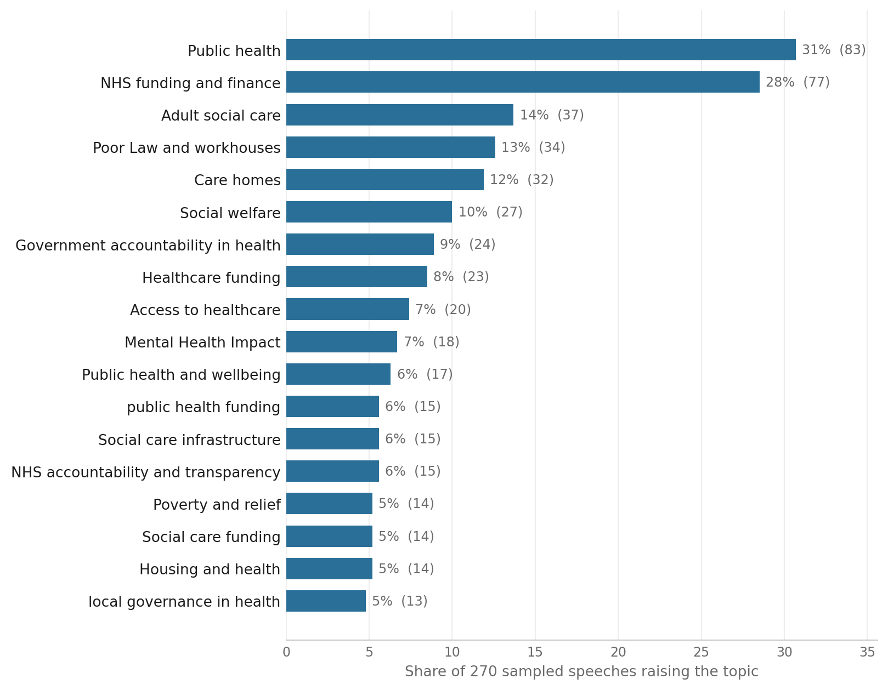
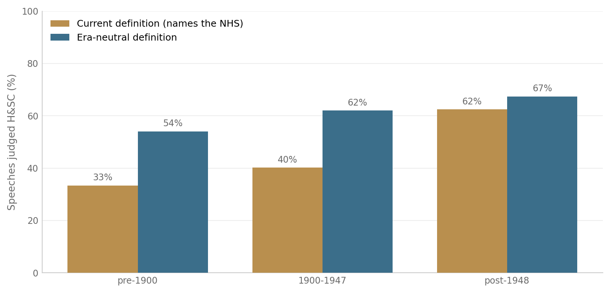
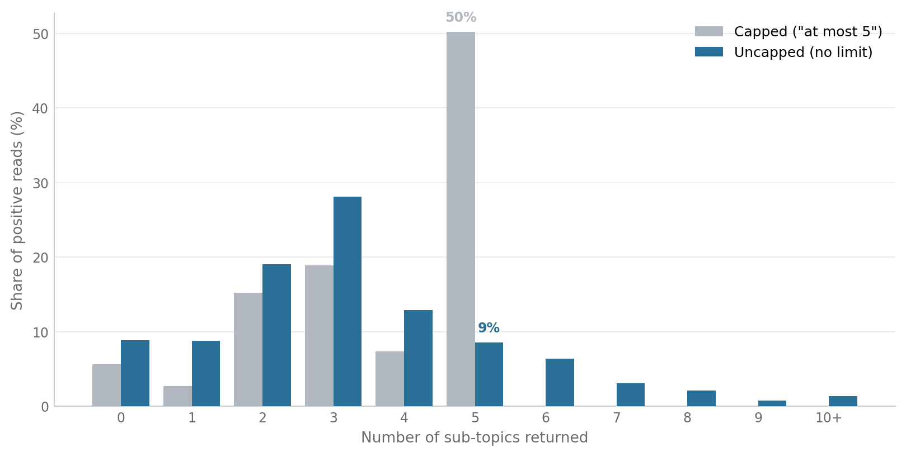

## 1. The goal

We want to measure what Parliament has said about health and social care (H&SC)
across the full Hansard record, 1803 to the present. For every speech we want to
know two things: whether it substantively engages H&SC, and if so which aspects of
it the speaker raises. With that in place we can trace how the volume and the mix
of H&SC debate shift over two centuries, by era and by topic. The obstacle is
scale. The record runs to millions of speeches, far more than anyone can read, so
the measurement has to be done by machine and then trusted. This note describes
the pipeline we have built to do that, the pilot we ran to test it, and the
substantive questions we now need domain input on before scaling up.

## 2. The main pipeline, step by step

The production pipeline has four stages. Each exists for a reason worth stating,
because the reasons are also where the method could go wrong.

1. Narrow the corpus to plausible candidates. The large majority of Hansard never
   touches H&SC, so running a language model on every speech would be wasteful. In
   production this stage will be a semantic search over sentence embeddings,
   retrieving speeches close in meaning to H&SC whatever their exact wording, and
   that retrieval step will itself need validation. For now we use a broad keyword
   net (NHS and public-health terms for the modern era; Poor Law, workhouse,
   sanitary-reform and epidemic-disease terms for the nineteenth century) as a
   deliberate placeholder: it is crude, but it lets us build and test the rest of
   the pipeline without waiting on the retrieval work. Either way this stage decides
   only what gets looked at, never the answer, and it is deliberately
   over-inclusive. It leaves a few hundred thousand candidate speeches rather than
   millions.

2. Read each candidate with a language model. For every surviving speech the model
   answers three questions: does this speech substantively discuss H&SC (yes or
   no); if so, which sub-topics does it raise; and a supporting verbatim quote.
   The judgement needs to weigh meaning in context, which a keyword cannot do. The
   sub-topics are free text, written by the model rather than chosen from a fixed
   list, because the aim is to discover what is actually discussed rather than to
   score speeches against categories we set in advance.

3. Aggregate the free-text sub-topics into a taxonomy. The models describe the
   same idea in many wordings, so to count topics we group same-meaning phrases
   automatically and label each group. Section 5 explains how, and why this step
   is more delicate than it looks.

4. Turn the labelled topics into measures over time. The payoff is prevalence: how
   much of H&SC debate each topic occupies, and how that changes across the 220
   years.

Stage 2 sends the model a short instruction, an output-format request, and the
speech. The core elements are reproduced verbatim below; the pilot varies their
surface form (Section 3) but not their meaning. The topic definition is carried
inside the instruction, which makes it easy to overlook as a piece of wording. It
is in fact the most consequential setting in the pipeline, and Section 5 shows
what happens when it changes.

Instruction (one of two paraphrases):

> Determine whether the parliamentary speech below substantively discusses health
> and social care — that is, UK health and social care policy: the NHS, public and
> mental health, adult social care, care homes, and the people who provide or rely
> on that care — rather than merely mentioning it in passing. If it does, identify
> the specific sub-topics of health and social care that it discusses. Describe
> each sub-topic in your own words as a short phrase (a few words). Give at most 5
> sub-topics. Also provide the single most relevant verbatim quotation from the
> speech as supporting evidence.

Output format (the structured condition):

> Respond with a single JSON object and nothing else, with exactly these keys:
> "mentions_topic" (true or false), "subthemes" (an array of short free-text
> phrases, empty if mentions_topic is false), and "evidence_quote" (a string,
> empty if mentions_topic is false).

The other output condition gives no format instruction at all, leaving the model
to answer in free text. When present, an optional system message adds a role: "You
are an expert analyst of health and social care policy in the United Kingdom, with
a deep understanding of parliamentary debate."

## 3. The pilot: a test before scaling

Running stages 1 to 4 on the whole corpus is expensive and hard to undo, so we
first tested the approach on a sample of 270 speeches, stratified across eras and
speech lengths. The pilot adds one thing the production run will not use: a
robustness harness. Instead of reading each speech once, we read it many ways and
check that the answer is driven by the speech rather than by incidental choices of
model or wording. If the answers move a lot under variation, the production
numbers are not yet trustworthy.

Concretely, each speech was read by four models (three production candidates plus
one larger reference model) under eight wordings of the same request, varying the
role framing, the paraphrase, and the output format. That is 32 independent reads
per speech. Two results frame everything that follows:

- On the yes/no presence question the reads agree with each other about 82% of the
  time, which is solid but short of unanimous.
- The share of speeches counted as being about H&SC ranges from 34% to 81%
  depending on prompt and model, averaging around 51%. Much of that swing comes
  from the output format: asking for free-text output puts presence at about 55%,
  while asking for structured output puts it at about 43%. The headline rate is
  therefore sensitive to prompt design, which is one reason the substantive checks
  below matter.

## 4. What the models found: the topic map

Across the 270 speeches the models emitted 8,692 distinct sub-topic phrases.
Grouped by meaning, the most common topics are shown below. Both modern NHS-era
themes and nineteenth-century themes such as Poor Law, sanitation and housing
appear. This coverage should be read with the sampling in mind: the keyword net
was deliberately built to include both modern and historical H&SC vocabulary, so
the presence of both is partly a consequence of how the sample was seeded rather
than independent evidence about the balance of the corpus. What the map does show
is what the models surface as sub-topics once a speech is placed in front of them,
and that is what the rest of this note examines.

Each row below is a machine-discovered topic, that is, a cluster of same-meaning
phrases, ranked by how many of the 270 speeches raise it. The "Phr." column counts
how many distinct wordings the models used for that one idea. The label in each row
is the cluster's medoid: the single emitted phrase closest to the cluster's centre
in meaning-space, chosen automatically rather than written by us. Nothing here is
hand-edited, which is why some labels read awkwardly or are oddly cased (for
example "Mental Health Impact" or "local governance in health"). Naming the topics
well is one of the domain judgements we are asking for.

| # | Merged topic | Speeches | Phr. | Example sub-themes the models wrote |
|:--|:----------------------|:---------|----:|:----------------------------------------------|
| 1 | Public health | 83 (31%) | 99 | Public health policy; Public health infrastructure; Public health response |
| 2 | NHS funding and finance | 77 (28%) | 365 | NHS funding; NHS; National Health Service |
| 3 | Adult social care | 37 (14%) | 39 | Adult social care provision; Adult social care governance; Adult social care regulation |
| 4 | Poor Law and workhouses | 34 (13%) | 187 | Poor Law administration; Poor Law; Workhouse conditions |
| 5 | Care homes | 32 (12%) | 38 | Institutional care; Institutional care conditions; Care homes for old people |
| 6 | Social welfare | 27 (10%) | 33 | Social welfare provision; Social welfare policy; Social welfare funding |
| 7 | Government accountability in health | 24 (9%) | 61 | Public health governance; Government accountability in health policy; Government transparency in health |
| 8 | Healthcare funding | 23 (8%) | 31 | healthcare financing; Health service funding; Hospital Funding |
| 9 | Access to healthcare | 20 (7%) | 38 | Access to care; Healthcare access; Access to treatment |
| 10 | Mental Health Impact | 18 (7%) | 15 | Mental health; Mental health impacts; Mental health effects |
| 11 | Public health and wellbeing | 17 (6%) | 8 | Public or mental health; Public or mental health policy; Public health (mental wellbeing) |
| 12 | public health funding | 15 (6%) | 30 | Public health financing; Public health finance; Public health funding and expenditure |
| 13 | Social care infrastructure | 15 (6%) | 16 | Social care provision; Social care policy; Social care provisions |
| 14 | NHS accountability and transparency | 15 (6%) | 41 | Health service accountability; NHS accountability; NHS accountability and governance |
| 15 | Poverty and relief | 14 (5%) | 20 | Poverty relief; Poverty relief management; Poverty and destitution |
| 16 | Social care funding | 14 (5%) | 49 | Adult social care funding; Public funding of care; Funding for social care services |
| 17 | Housing and health | 14 (5%) | 47 | Housing conditions affecting health; Housing and public health; Public health and housing conditions |
| 18 | local governance in health | 13 (5%) | 48 | local health governance; local health planning; Local governance of health |
| 19 | Health workforce | 13 (5%) | 25 | Healthcare workforce; Health workforce planning; Medical workforce planning |
| 20 | Mental health services and community care | 13 (5%) | 40 | Mental health services; Mental health support; Mental health provision |
| 21 | Affordable housing | 12 (4%) | 29 | Housing; Housing for the working classes; Housing for the poor |
| 22 | Public funding allocation | 12 (4%) | 21 | Government funding; Public funding; Public Expenditure |
| 23 | Sanitary conditions | 12 (4%) | 31 | public health and sanitation; Sanitation and hygiene; Sanitation and disease prevention |
| 24 | Local authority powers | 12 (4%) | 22 | Local authority responsibility; Local authority role; Local authority duties |
| 25 | Care home regulation | 11 (4%) | 29 | Social care regulation; Care home regulation and administration; Care homes regulation |
| 26 | NHS employment | 11 (4%) | 68 | NHS workforce; NHS recruitment; NHS workforce planning |
| 27 | Health legislation | 11 (4%) | 10 | Public health legislation; Healthcare legislation; Health service legislation |
| 28 | Infectious disease control | 11 (4%) | 20 | Infectious disease; Infection control; Infectious disease prevention |
| 29 | Healthcare administration | 11 (4%) | 11 | Health administration; Health service administration; Healthcare management |
| 30 | Healthcare access inequality | 10 (4%) | 31 | Healthcare inequality; Health inequalities; Inequality in healthcare access |
| 31 | Local administration and governance of care | 10 (4%) | 16 | Governance of care institutions; Governance of social care services; Social care governance |
| 32 | Housing conditions | 10 (4%) | 19 | Living conditions; Housing and living conditions; Housing standards |
| 33 | Healthcare resource allocation | 10 (4%) | 19 | resource allocation in health; Resource allocation for healthcare; Health Resource Allocation |
| 34 | Health policy | 10 (4%) | 11 | Healthcare policy; health policy consultation; Health policy measures |
| 35 | Government accountability | 10 (4%) | 7 | Government Responsibility; Political accountability; Democratic accountability |
| 36 | Public health campaigns | 9 (3%) | 16 | public health initiatives; Public health awareness campaigns; Public health communication |
| 37 | NHS response to infection | 9 (3%) | 19 | NHS response; NHS response to outbreaks; NHS response to pandemic threat |
| 38 | Public health and prevention | 9 (3%) | 25 | Public health prevention; Preventative healthcare; preventive healthcare |
| 39 | Health care charges | 9 (3%) | 30 | Healthcare charges; Healthcare costs; Health service costs |
| 40 | Disease control | 9 (3%) | 8 | Disease prevention; Disease control measures |

A long tail of some 700 smaller topics sits below this list and grows
increasingly specific. It is available on request.

## 5. Where the sub-topics come from, and why aggregation is delicate

The topic map is not a neutral readout of what Parliament said. It is shaped at
several points by choices we made, each of which the pilot suggests we should
revisit with domain input.

**The definition sets the era profile.** Everything else in this note is measured
against one definition of H&SC, the one quoted in Section 2, which names the NHS,
adult social care and care homes. Those are institutions that did not exist for
the first century and a half of the record, so the wording risks reading the
nineteenth century as quiet about health simply because it lacked the vocabulary.
We tested this by re-running the same speeches, models and formats against an
era-neutral rewrite that describes the function rather than the institution: the
health of the population and the care of people who are sick, injured, disabled,
elderly or destitute, however that care is provided and paid for. The effect is
large, and concentrated exactly where the concern predicted. Under the current
definition the share of speeches judged H&SC climbs from 33% before 1900 to 62%
after 1948; under the era-neutral wording it runs from 54% to 67%, and the rise
across the record falls from 29 to 13 percentage points (Figure 2). The two
definitions agree on 82% of individual reads, and the disagreements run almost
entirely one way: the era-neutral wording adds speeches, in 23% of pre-1900 reads
but only 7% of post-1948 ones. On this evidence a good part of the apparent
growth in health debate after the NHS is an artefact of how we asked the question.

This does not establish that the era-neutral wording is the right one. Reading the
speeches it newly admits shows both kinds of case. Some are plain misses by the
current definition: an 1868 exchange in which the Poor Law Board sets standards
for the diet, lodging and work of vagrants is unmistakably the Victorian care
system, and the current wording scored it as H&SC in only one read out of eight.
Others look like over-reach: an 1856 debate about which body should hold powers
under an agricultural statistics bill was counted as H&SC by seven of eight reads
because the Poor Law Board happens to be named in it, which is precisely the
passing mention the instruction rules out. That second case is worth stating
plainly, because it is the same failure as before rather than a new one. The old
wording triggered on the token NHS; the new one triggers on tokens like Poor Law
Board. Changing the definition moved which century the anchoring flatters, but did
not stop the models keying on institution names instead of on whether care is the
subject of the speech. Choosing between the two wordings, and repairing whichever
we keep so that neither trap fires, is a domain judgement and not something a
further run can settle.

**The prompt's output format changes the result.** Each read was asked either for
free-text output or for structured output, and this matters more than expected.
The number of sub-topics per speech is unaffected (about 3.8 either way, often
hitting the cap of five), so the format does not squeeze the count. What it changes
is the wording and the presence rate. Free-text output produced 5,903 distinct
phrasings; structured output produced only 3,639, roughly 40% fewer, because
structured output regularises how the model names the same idea while free text
lets it drift. Free-text output also raised the presence rate (55% versus 43%) and
failed to parse cleanly about 5% of the time, which is the source of the noise
described below. So the raw phrase counts in the table, and how badly topics
fragment, are partly a property of prompt design rather than of the speeches. In
production we will fix a single output format, and that is itself a measurement
decision, not just an engineering one.

**The five-topic cap inflates the count.** The instruction asks for at most five
sub-topics, and we have now tested removing it: the same speeches, models and
formats, run once with the "at most five" sentence and once without. The cap turns
out to work as an anchor, not just a ceiling. With the cap, half of all positive
reads return exactly five sub-topics and the median is five. Without it, that spike
disappears (only 9% land on five), the distribution settles onto a smooth curve
centred on two to three, and the median drops to three (Figure 3). About 14% of
speeches genuinely warrant more than five sub-topics when allowed, up to eighteen,
but those are the minority; the dominant effect is the cap pulling the many
lower-content speeches up towards five. Presence is unaffected (48% either way), so
this is purely about how many sub-topics get counted, not whether a speech is
judged to be about H&SC. The practical implication is that any count-based measure
built on the capped runs is biased upward, so production should drop the cap or set
it far higher.

**Aggregation depends on one threshold.** Same-meaning phrases are merged by
converting each phrase into a numeric representation of its meaning (an embedding)
and clustering the ones that sit close together, with each cluster labelled by its
most central phrase (its medoid). A single setting controls how readily phrases merge. Set it
loose and unrelated ideas get lumped together; set it tight and one idea fragments
into several topics. We currently keep it tight to avoid false merges, and the
cost of that is visible in the table: Public health (row 1) sits apart from Public
health and wellbeing (11), public health funding (12), Public health campaigns
(36) and Public health and prevention (38), and the same fragmentation runs
through the funding rows (2, 8, 12, 16, 22) and the governance rows (7, 14, 24, 31,
35). Where these should be merged, and how broad the final families should be, is a
domain judgement rather than a distance measurement.

**A small share of entries are formatting noise, not content.** From the free-text
parse failures above, a model's answer sometimes leaked into the topic field.
These are a known and fixable side effect, not real findings, but they are worth
seeing:

- Does the speech substantively discuss health and social care? No
- Sub-topics of health and social care discussed: None
- Most relevant verbatim quotation (for context): ...

Taken together, the prevalence numbers depend jointly on the definition, the
output format, the five-topic cap, and the clustering threshold. We can now put
rough sizes on the first two: the definition moves the era profile by around 16
percentage points of slope, and the output format moves the headline rate by about
12 points. None of the four is settled by the machine, which is precisely why the
next step is substantive rather than technical.

## 6. What we need next

Two pieces of work now need domain input, and they are the reason for this brief.

The first is a substantive review of the current map:

1. Scope. Section 5 shows the definition is the most consequential setting we
   have found, and the pilot cannot resolve it: the two wordings we tested fail in
   opposite directions. Which is closer to how the field bounds H&SC, and how
   would you word it so that neither the NHS nor the Poor Law Board pulls a speech
   in on the strength of being mentioned?
2. Completeness. Is any important H&SC theme missing that Parliament would have
   debated across this period?
3. Correctness. Is any listed topic wrong, or wrongly counted as H&SC?
4. Grouping and grain. How far should the over-split topics in Section 5 be merged,
   and at what level of detail should the final set sit?

The second is designing how the production pipeline will be evaluated, which the
paper will stand or fall on. The pilot only shows that the models agree with each
other, which is consistency, not that they agree with the field, which is validity.
To close that gap we need to build, together:

- A gold standard: a set of speeches hand-labelled by domain experts for presence
  and for sub-topics. This is the reference the whole system is measured against,
  and the definition experiment has already produced an efficient starting set.
  On 159 of the 270 pilot speeches the two definitions reach different verdicts, 92
  of them by a wide margin, and those are the speeches where the boundary is
  actually being decided rather than being obvious. They are laid out in
  `definition_review.html`, an offline page that shows each speech next to what the
  models said under both definitions and records a yes, borderline or no judgement
  with a note, then exports the lot as a spreadsheet. Working through the contested
  set is worth considerably more per speech than labelling a random sample, in
  which most cases are easy and carry little information.
- An evaluation protocol we can re-run unchanged whenever a model, prompt, or
  threshold changes: presence scored against the gold labels, and sub-topics
  scored on whether the model's topics match the experts' in meaning.
- A decision, informed by that protocol, on the production settings the pilot has
  shown to matter: the definition, the output format, the sub-topic cap (Section 5
  shows the current five is biasing counts), and the clustering grain.

Any form works for a first pass: notes in the margin, a shared document, or a call.

## Appendix: reference

A. Filter keywords. The placeholder net from Section 2 matches the terms below, as
word stems, in three groups. A speech enters the sample if it matches any of them;
the terms decide only what is looked at, never the answer.

- Modern (NHS and welfare state): social care, care home, domiciliary care,
  residential care, adult social care, care worker, carer, NHS, national health
  service, public health, mental health, health care, healthcare.
- Pre-NHS (Poor Law and sanitary reform): poor law, workhouse, pauper, board of
  guardians, relieving officer, district nursing, lunatic asylum, feeble-minded,
  mental deficiency, friendly society, infirmary, almshouse, sanitary, board of
  health, fever hospital, vaccination, smallpox, cholera, tuberculosis, medical
  officer of health, dispensary.
- Epidemic and pandemic: covid, coronavirus, pandemic, long covid, lockdown,
  furlough, epidemic, influenza, spanish flu, quarantine, outbreak, typhoid,
  typhus, diphtheria, scarlet fever, plague.

B. Prompt, second paraphrase. Section 2 gives the first wording of the
instruction. The pilot also uses this second, meaning-preserving paraphrase:

> Read the parliamentary speech below. Decide if health and social care is a
> substantive subject of the speech and not just a passing reference. Treat health
> and social care as: UK health and social care policy: the NHS, public and mental
> health, adult social care, care homes, and the people who provide or rely on that
> care. When it is a substantive subject, list the particular aspects of health and
> social care it covers, each as a brief free-text label of a few words. Provide no
> more than 5 such labels. Include a short supporting quotation taken word-for-word
> from the speech.

Role and output format vary as in Section 2 (role present or absent, output
structured or free text), giving eight prompt combinations in all.

C. Definition wordings tested. Both are dropped into the same slot in the
instruction, after "substantively discusses health and social care, that is,".
Everything else in the prompt is identical, so the contrast between them is the
definition and nothing else.

> Current: UK health and social care policy: the NHS, public and mental health,
> adult social care, care homes, and the people who provide or rely on that care.

> Era-neutral: the health of the population and the care of people who are sick,
> injured, disabled, elderly or destitute, however that care is provided and paid
> for, whether by the state, local authorities, hospitals, charities, religious
> bodies or families.

Two further wordings, one narrower (clinical services only) and one broader
(including the social determinants of health such as housing, sanitation and
nutrition), are prepared but not yet run. They are intended to bracket the
construct so the headline prevalence can be reported as a range rather than a
single number, and are worth running once the definition question above is
settled.

D. Extended topic list, ranks 41 to 100. This continues the table in Section 4. Of
the roughly 700 machine-discovered topics, 141 are raised by four or more speeches.

| # | Merged topic | Speeches | Phr. |
|:--|:-----------------------------|:---------|----:|
| 41 | Funding | 8 (3%) | 8 |
| 42 | Sewage and sanitation | 8 (3%) | 31 |
| 43 | Public trust in the NHS | 8 (3%) | 13 |
| 44 | Carer support and well-being | 8 (3%) | 40 |
| 45 | Protection of vulnerable populations | 8 (3%) | 8 |
| 46 | Regulatory oversight | 8 (3%) | 13 |
| 47 | Children's homes and residential care | 8 (3%) | 45 |
| 48 | Ministerial oversight in health | 7 (3%) | 25 |
| 49 | Health Service | 7 (3%) | 9 |
| 50 | Integration of health and social care | 7 (3%) | 31 |
| 51 | Health and social care policy coordination | 7 (3%) | 10 |
| 52 | Immunisation policy | 7 (3%) | 37 |
| 53 | Healthcare Regulation | 7 (3%) | 19 |
| 54 | Public financial accountability | 7 (3%) | 8 |
| 55 | Patient safety in healthcare | 7 (3%) | 18 |
| 56 | Social care and housing for vulnerable groups | 7 (3%) | 8 |
| 57 | Workhouse medical care | 7 (3%) | 18 |
| 58 | Healthcare reform | 7 (3%) | 11 |
| 59 | Hospital design | 6 (2%) | 22 |
| 60 | Tuberculosis treatment and control | 6 (2%) | 41 |
| 61 | Government oversight in health | 6 (2%) | 10 |
| 62 | Local Authority Care | 6 (2%) | 11 |
| 63 | Impact of economic policy on health care | 6 (2%) | 15 |
| 64 | NHS estate | 6 (2%) | 50 |
| 65 | Post-war social needs | 6 (2%) | 23 |
| 66 | Old age pensions | 6 (2%) | 30 |
| 67 | Government oversight | 6 (2%) | 6 |
| 68 | Parliamentary Scrutiny | 6 (2%) | 8 |
| 69 | Public participation in healthcare decision-making | 6 (2%) | 32 |
| 70 | Public relief systems | 6 (2%) | 6 |
| 71 | Healthcare professional support | 6 (2%) | 11 |
| 72 | government healthcare planning | 6 (2%) | 12 |
| 73 | Public health administration | 6 (2%) | 5 |
| 74 | Global public health | 6 (2%) | 14 |
| 75 | Hospital care | 6 (2%) | 5 |
| 76 | Social security funding | 5 (2%) | 15 |
| 77 | Social services management | 5 (2%) | 22 |
| 78 | medical care for the poor | 5 (2%) | 21 |
| 79 | Patient care | 5 (2%) | 7 |
| 80 | Community wellbeing | 5 (2%) | 5 |
| 81 | Social care legislation and reform | 5 (2%) | 14 |
| 82 | Health care prioritisation | 5 (2%) | 15 |
| 83 | Historical health policy | 5 (2%) | 13 |
| 84 | Free healthcare at the point of use | 5 (2%) | 12 |
| 85 | NHS information provision | 5 (2%) | 26 |
| 86 | Parliamentary timing of health legislation | 5 (2%) | 16 |
| 87 | Poverty and health | 5 (2%) | 6 |
| 88 | Public health and food poverty | 5 (2%) | 10 |
| 89 | Public health response to epidemic | 5 (2%) | 29 |
| 90 | Armed forces healthcare | 5 (2%) | 7 |
| 91 | Support for vulnerable individuals | 5 (2%) | 4 |
| 92 | Local authority health responsibilities | 5 (2%) | 12 |
| 93 | NHS Commissioning | 5 (2%) | 20 |
| 94 | Overcrowding and housing | 5 (2%) | 16 |
| 95 | Decision-making processes in care and legal proceedings | 5 (2%) | 7 |
| 96 | Local authority housing provision | 5 (2%) | 14 |
| 97 | public health policy implementation | 5 (2%) | 6 |
| 98 | Local taxation | 5 (2%) | 6 |
| 99 | Older people's care | 5 (2%) | 30 |
| 100 | Disease outbreaks | 5 (2%) | 6 |

E. Most common sub-topic phrases, verbatim, before grouping. These show the raw
vocabulary and how much case and wording variation there is.

| Sub-theme phrase (verbatim) | Speeches | Total emissions |
|---|---:|---:|
| Public health | 45 | 130 |
| public health | 31 | 65 |
| Public Health | 26 | 84 |
| Adult social care | 25 | 40 |
| NHS funding | 23 | 128 |
| Public health policy | 22 | 37 |
| Care homes | 18 | 30 |
| National Health Service | 15 | 76 |
| NHS | 15 | 28 |
| Social welfare | 14 | 21 |
| Poor Law administration | 13 | 41 |
| Poor Law | 12 | 22 |
| Public health infrastructure | 12 | 25 |
| NHS governance | 10 | 30 |
| Mental health | 9 | 15 |
| Workhouse conditions | 7 | 40 |
| Disease prevention | 7 | 26 |
| Housing conditions | 7 | 27 |
| Mental health services | 7 | 29 |
| Patient safety | 7 | 21 |

F. Pilot facts. 270 speeches, read by four models under eight prompt wordings each
(32 reads per speech at temperature zero), producing 8,692 distinct sub-topic
phrases and 15,634 total phrase emissions. That core grid is accompanied by two
controlled experiments of 2,160 reads each, matched to it on speech, model and
format: the uncapped arm behind Section 5's cap finding, and the era-neutral arm
behind the definition finding. The sample spans 1803 to the present. Sub-topics are
generated by the models rather than chosen from a list. All figures come from the
current pilot run.
